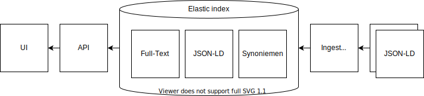

# Transcripties Zoeken & Tonen

Op deze website zoekt u in de tekst van handgeschreven documenten. De documenten zijn afkomstig uit de archieven van de Verenigde Oost-Indische Compagnie (VOC) uit de 17e en 18e eeuw en archieven van notarissen uit de 19e eeuw.

- TODO up to date JSON-LD / WebAnnotations
- TODO data map toevoegen aan publieke repos
- TODO licentie

## Opzet

De frontend van het IJsberg project bestaat uit de user interface en de zoekmachine. Anders dan wat de naam frontend suggereert kan het project geheel onafhankelijk werken van de backend van het IJsberg project. Alle data die wordt gebruikt door de user interface en via de API wordt aangeboden wordt aangeboden vanuit de Elastic index die onderdeel is van de frontend.

De backend stuurt een JSON-LD bestand met daarin alle inventarisnummer met gelinkte transcriptiepagina’s en de relevante named entities. De **ingest service** zal deze bestanden via een HTTP POST ontvangen, eventueel decomprimeren en controleren op syntactische validiteit. Dit laatste zal worden gedaan met behulp van een JSON Schema check, welke tevens voor de OpenAPI definitie zal worden gebruikt. Na deze syntactische controle zullen we de named entities naar het Elastic cluster sturen en vervolgens het inventarisnummer samen met alle transcriptiepagina’s als één document naar het Elastic cluster sturen. Succesmeldingen en errors worden terug gegeven aan de versturende partij. De ingest service werkt per inventarisnummer en geeft direct een melding terug als de verwerking succesvol of niet is. De service werkt snel en kan met gemak parallel bestanden ontvangen. De bottleneck qua performance ligt bij de Elastic index.

TODO batch script ingest.

De **search service** geeft toegang tot de gegevens in de Elastic index en is verantwoordelijk voor de API’s die worden gebruikt door de projectwebsite user interface. Deze API’s vormen tevens de Linked Data toegangspoort. De zoekresultaten en documenten zullen namelijk als JSON-LD Linked Data worden geformatteerd. Dit is ook het formaat dat intern door de user interface wordt gebruikt. Alle hier genoemde API’s werken via het HTTP protocol.

- search endpoint
- document endpoint

TODO OpenAPI

### JSON-LD

### Elastic indices

De kern van de ‘frontend’ zijn een aantal Elastic indexen. Er zijn drie indexen:

Full text index met filters: nested document
Highlights

### User Interface componenten

Histogram, hiërarchisch filter
Query expansie met synoniemen
Filteren op namen. Geen autocomplete
Zoekresultaten met hits per pagina binnen een document

#### Zoekinterface

#### Transcriptie viewer

## Gebruikte technieken

- TypeScript - alle code in dit project is geschreven in deze taal, een variant van JavaScript
- Angular - het frontend framework dat gebruikt wordt om de user interface te bouwen
- NodeJS - de taal voor de backend
- OpenApi - voor het documenteren van de rest api
- Elastic - opslag en doorzoeken van transcripties
- Opensea Dragon - IIIF viewer voor zowel de collection view als de individuele scans

## Overzicht links

- Productie url: https://zoekintranscripties.nl/
- Test url: https://test.zoekintranscripties.nl/

- Sitemap url: https://zoekintranscripties.nl/sitemap.xml
- Productie api: https://api.zoekintranscripties.nl/
- Productie ingest: https://ingest.zoekintranscripties.nl/
- Test api: https://api-test.zoekintranscripties.nl/
- Test ingest: https://ingest-test.zoekintranscripties.nl/

- OpenAPI documentatie api: https://api.zoekintranscripties.nl/docs/
- OpenAPI documentatie ingest: https://ingest.zoekintranscripties.nl/docs/

- Angular code documentatie: https://zoekintranscripties.nl/documentation/

## Mappenstructuur codebase

- **/web** In deze map staat de code voor de frontend. Deze is geschreven in Angular en volgt zoveel mogelijk de standaard Angular patterns. De applicatie maakt gebruik van Angular Universal voor het serverside renderen van de templates en van Datorama Akita voor state management. Daarnaast gebruikt de applicatie OpenSeaDragon voor het tonen van transcripties en de Angular Tree Component voor de boomstructuur in de inventarissenfilter. Zie de gegenereerde Angular documentatie voor een overzicht van alle componenten.

- **/api** In deze map staat de code voor de api. De api ontvangt verzoeken van de fronted en praat met ElasticSearch database om de juiste data te tonen. De applicatie maakt gebruikt van Tsoa om op een efficiënte manier documentatie te genereren aan de hand van TypeScript typings.

- **/ingest** De ingest applicatie zorgt ervoor dat transcripties in ElasticSearch geladen kunnen worden. In deze applicatie worden een aantal transformaties gedaan voordat de transcriptie naar Elastic gestuurd wordt. Hierdoor wordt het zoeken efficiënter en sneller.

- **/data/elastic** Hier staat beschreven hoe ElasticSearch geconfigureerd moet worden. Door het bestand mapping.sh uit te voeren kan een Elastic instantie worden ingericht. Let hierbij op dat de juiste instantie wordt benaderd.

##  Installatie

Om deze applicatie te lokaal te draaien heb je NodeJS 14 of hoger en eventueel Docker nodig.Het is ook mogelijk om in de ontwikkelomgeving te praten met data van de testomgeving. In sommige gevallen kan dit handig zijn om functionaliteiten te testen. Dit kan door een ‘environment variable’ aan te passen, zie de readme van de api en ingest voor meer informatie. Zie de readme in de codebase voor de exacte commando’s die gedraaid dienen te worden om de applicatie te installeren.

- Run Elastic in Docker: `docker run -p 9200:9200 -p 9300:9300 -e "discovery.type=single-node" docker.elastic.co/elasticsearch/elasticsearch:7.10.0`
- Configure elastic indices: `bash data/elastic/mapping.sh`
- Run `npm install` to install all dependencies.
- Run `npm start` to start the project

- The web app runs on http://localhost:4200
- The api runs on http://localhost:8080
- The ingest runs on http://localhost:5000

### Deployment

Op dit moment is een CI pipeline opgezet door middel van het gebruik van Bitbucket Pipelines. Er wordt gebruikt gemaakt van git branches ‘master’ en ‘test’. Indien wijzigingen worden gepusht naar deze branches wordt de code automatisch online gezet naar de respectievelijke omgeving.

- Look at the README.MD of each subfolder (/api, /ingest and /web)
- You can run npm command from the root folder using the --prefix flag. For example run `npm run build --prefix api` to build the api files.
- The `/data` folder is for development/testing purposes only