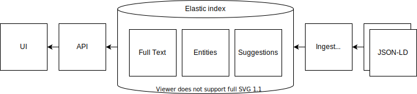

# Transcripties Zoeken & Tonen

## Opzet

De frontend van het IJsberg project bestaat uit de user interface en de zoekmachine van het project. Anders dan wat de naam frontend suggereert kan de frontend onafhankelijk werken van de backend van het IJsberg project: alle data door de user interface en via de API wordt aangeboden komt uit de zoekmachine van de frontend.

De backend stuurt een JSON-LD bestand met daarin alle inventarisnummer met gelinkte transcripties en de relevante named entities. De backend genereert de JSON-LD bestanden vanuit de archiefbeschijvingen in de EAD, de PAGE XML's van de transcripties en de METS links. De laatste geven de locaties van de scans op de IIIF server van het Nationaal Archief weer. De **ingest service**  ontvangt deze bestanden via een HTTP POST, decomprimeert ze eventueel en controleert het bestand op syntactische validiteit. Dit laatste wordt gedaan met behulp van een JSON Schema check. Na deze syntactische controle worden de entiteiten en het inventarisnummer samen met alle transcripties als één document naar het Elastic cluster gestuurd. Succesmeldingen en errors worden terug gegeven aan de versturende partij. De ingest service werkt per inventarisnummer en geeft direct een melding terug als de verwerking succesvol of niet is. De service werkt snel en kan met gemak parallel bestanden ontvangen. De bottleneck qua performance ligt bij de Elastic index. De API documentatie van de ingest service: https://ingest.zoekintranscripties.nl/docs/

Wij hebben voor testtoepassingen een Python **batchscript** geschreven dat zeer snel de JSON-LD kan genereren op basis van bestanden die in het filesystem staan opgeslagen. Het testscript kan de ingest service overslaan en direct naar de Elastic indices schrijven of via de ingest service werken. Het script geeft door haar beperkte formaat een goed beeld van de opbouw van de JSON-LD. Het script voegt geen named entity recognition uit, maar het aanroepen van een NER script is zonder veel moeite te realiseren.

De kern van de frontend zijn een aantal Elastic indices:

De **entities index**: de JSON-LD die naar de ingest service wordt gestuurd wordt per entiteit opgeslagen. Iedere entiteit in het JSON-LD bestand (de graph) heeft een URI en onder deze URI worden de entiteiten opgeslagen als JSON objecten. Deze index wordt alleen gebruikt om de entiteiten gemakkelijk en snel ter beschikking te hebben. Elastic slaat de JSON objecten gecomprimeerd op, waardoor het ruimtegebruik ook minimaal is. Het is goed mogelijk en bij zeer grote hoeveelheden data ook aan te raden om voor deze functie een object store te gebruiken.

De **suggestions index** bevat de suggesties voor de interactieve query expansie. Na het versturen van de query wordt er gezocht naar de trefwoorden in de query en wordt een uitgebreide zoekopdracht gedaan. Wij maken gebruik van een index met suggesties en een  query parser / herschrijver omdat we meer controle willen over de query expansie dan mogelijk is met het standaard mechanisme in Elastic. De suggestions index wordt gevuld met het historisch woordenboek van het INT en de VOC toponiemenlijst van het Huygens. Beide kunnen wij niet opnemen in de publiekelijk beschikbare sourcecode.

De **full text index**, oftewel de inventory index, bevat de geindexeerde teksten en metadata van de inventarisnummers. In deze index is geen JSON object te vinden, maar is de metadata uit de archiefbeschrijving waarop wordt gezocht of gefilterd en de volledige tekst van de transcripties te vinden. De inventarisnummers zijn als 'nested' documents geindexeerd, met de transcriptietekst en de relevante metadata als genest document. De hierarchie en de beschrijvende tekst uit de archiefbeschrijving is op het geneste niveau te vinden, omdat het alleen mogelijk is om op dit niveau queries uit te voeren. De tekstvelden maken gebruik van pre-computed 'offsets' voor het snel vaststellen van de highlights bij het uitvoeren van een query.

De **search service** geeft toegang tot de gegevens in de Elastic index en is verantwoordelijk voor de API’s die worden gebruikt door de projectwebsite user interface. Deze API’s vormen tevens de Linked Data toegangspoort. De zoekresultaten en documenten worden als JSON-LD Linked Data beschikbaar gesteld en ook door de user interface gebruikt. De API documentatie voor de search service: https://api.zoekintranscripties.nl/docs/

**https://api.zoekintranscripties.nl/entity** geeft de opgeslagen entiteit uit de JSON-LD graph weer. Deze call wordt gebruikt voor het tonen van de transcriptie

**https://api.zoekintranscripties.nl/inventory** wordt gebruikt om een inventaris op te vragen en hier eventueel binnen te zoeken. Deze call geeft de JSON-LD van het inventarisnummer, met daarin de metadata, de links naar alle scans en de detail JSON-LD van een aantal scans voor het tonen van de beelden in de collectionview. Via deze call kan er binnen het inventory worden gezocht door het meegeven van een querystring. Hierbij wordt  gebruik gemaakt van de query expansie. De API geeft aan op welke scans resultaten zijn gevonden en per scan waar de hits zich bevinden.

**https://api.zoekintranscripties.nl/search** wordt gebruikt door de zoekpagina. Een lege query wordt gebruikt voor het weergeven van de initiele filters (histogram en hierarchie). Standaard Lucene queries kunnen worden uitgevoerd. Het resultaat geeft weer welke query expansies zijn uitgevoerd. Deze worden in de UI gebruikt om een selectie te maken van deze expansies op basis van het historisch woordenboek van het INT en het VOC toponiemenbestand van het Huygens. De resultaten zijn gegroepeerd per inventarisnummmer. Er worden zoekhits getoond in zowel de archiefbeschrijving als de transcripties.  De gebruiker kan ervoor kiezen dat de gezochte termen voor moeten komen in een named entity veld. Dit maakt het mogelijk om specifieker te zoeken naar herkende entiteiten en daarmee in potentie irrelevante zoekresultaten te reduceren.

### JSON-LD

Een volldig voorbeeld van de JSON-LD kan [hier](data/examples/example.json) worden gevonden.

De JSON-LD is gebaseerd op de [IIIF presentation API](https://iiif.io/api/presentation/3.0/). In deze standaard wordt gebruikg gemaakt van annotaties op een canvas. De scan, een IIIF Image, is een annotatie op het canvas. Deze informatie is uit de zogenaamde METS files gehaa.d

De transcriptie is ook een annotatie op het canvas. Hier hebben wij ervoor gekozen om één annotatie te maken die de region, line en word structuur van de transcriptie weergeeft en de coordinaten voor een region, line en word direct weergeeft. Per word kan een referentie naar een named entity worden gegeven. Deze worden als aparte entiteiten in de JSON-LD opgenomen. Een geneste annotatiestructuur zou in de toekomst een goede verfijning zijn en een aanzet tot een standaard voor transcripties in IIIF kunnen zijn.

In de manifest van het IIIF presentation document is in de seeAlso eigenschap gebruikt voor de archiefbeschrijving voor het inventarisnummer uit de EAD. Deze hebben we geconverteerd naar de RICO standaard. Idealiter zou dit een aparte entiteit zijn met een referentie vanuit het IIIF manifest.

# Technische informatie

## Gebruikte technieken

- TypeScript - alle code in dit project is geschreven in deze taal, een variant van JavaScript
- Angular - het frontend framework dat gebruikt wordt om de user interface te bouwen
- NodeJS - de engine voor de backend
- OpenApi - voor het documenteren van de REST api
- Elastic - opslag en doorzoeken van transcripties
- Opensea Dragon - IIIF viewer voor zowel de collection view als de individuele scans

## Overzicht links

- Productie url: https://zoekintranscripties.nl/
- Test url: https://test.zoekintranscripties.nl/

- Sitemap url: https://zoekintranscripties.nl/sitemap.xml
- Productie api: https://api.zoekintranscripties.nl/
- Productie ingest: https://ingest.zoekintranscripties.nl/
- Test api: https://api-test.zoekintranscripties.nl/
- Test ingest: https://ingest-test.zoekintranscripties.nl/

- OpenAPI documentatie api: https://api.zoekintranscripties.nl/docs/
- OpenAPI documentatie ingest: https://ingest.zoekintranscripties.nl/docs/

- Angular code documentatie: https://zoekintranscripties.nl/documentation/

## Mappenstructuur codebase

**/web** In deze map staat de code voor de frontend. Deze is geschreven in Angular en volgt zoveel mogelijk de standaard Angular patterns. De applicatie maakt gebruik van Angular Universal voor het serverside renderen van de templates en van Datorama Akita voor state management. Daarnaast gebruikt de applicatie OpenSeaDragon voor het tonen van transcripties en de Angular Tree Component voor de boomstructuur in de inventarissenfilter. Zie de gegenereerde Angular documentatie voor een overzicht van alle componenten.

**/api** In deze map staat de code voor de api. De api ontvangt verzoeken van de fronted en praat met ElasticSearch database om de juiste data te tonen. De applicatie maakt gebruikt van Tsoa om op een efficiënte manier documentatie te genereren aan de hand van TypeScript typings.

**/ingest** De ingest applicatie zorgt ervoor dat transcripties in ElasticSearch geladen kunnen worden. In deze applicatie worden een aantal transformaties gedaan voordat de transcriptie naar Elastic gestuurd wordt. Hierdoor wordt het zoeken efficiënter en sneller.

**/data/elastic** Hier staat beschreven hoe ElasticSearch geconfigureerd moet worden. Door het bestand mapping.sh uit te voeren kan een Elastic instantie worden ingericht. Let hierbij op dat de juiste instantie wordt benaderd.

##  Installatie ontwikkelomgeving

Om deze applicatie te lokaal te draaien heb je NodeJS 14 of hoger en eventueel Docker nodig.Het is ook mogelijk om in de ontwikkelomgeving te praten met data van de testomgeving. In sommige gevallen kan dit handig zijn om functionaliteiten te testen. Dit kan door een ‘environment variable’ aan te passen, zie de readme van de api en ingest voor meer informatie. Zie de readme in de codebase voor de exacte commando’s die gedraaid dienen te worden om de applicatie te installeren.

- Run Elastic in Docker: `docker run -p 9200:9200 -p 9300:9300 -e "discovery.type=single-node" docker.elastic.co/elasticsearch/elasticsearch:7.10.0`
- Configure elastic indices: `bash data/elastic/mapping.sh`
- Run `npm install` to install all dependencies.
- Run `npm start` to start the project

- The web app runs on http://localhost:4200
- The api runs on http://localhost:8080
- The ingest runs on http://localhost:6000

## Project draaien

Dit kan door middel van docker. Zorg ervoor dat je 'Disk image size' minimaal 50GB is, want de hele dataset wordt ingeladen. Zie [Zenodo](https://zenodo.org/records/14568577) voor meer informatie over de dataset.

Voor het volgende commando uit om de dataset te downloaden. Het is ongeveer 20GB dus het kan even duren.
`curl -O https://zenodo.org/records/14568577/files/zit-data.tar.gz`

Het volgende commando is om de dataset in te laden in docker
`docker load --input zit-data.tar.gz`

Draai dit commando vanuit de root van de repository om alle applicaties in 1 keer op te starten.
`docker compose up -d --no-deps --build`

Ga naar [https://localhost:4000](https://localhost:4000) om de site te bekijken

## Deployment

Op dit moment is een CI pipeline opgezet door middel van het gebruik van Bitbucket Pipelines. Er wordt gebruikt gemaakt van git branches ‘master’ en ‘test’. Indien wijzigingen worden gepusht naar deze branches wordt de code automatisch online gezet naar de respectievelijke omgeving.

- Look at the README.MD of each subfolder (/api, /ingest and /web)
- You can run npm command from the root folder using the --prefix flag. For example run `npm run build --prefix api` to build the api files.
- The `/data` folder is for development/testing purposes only
